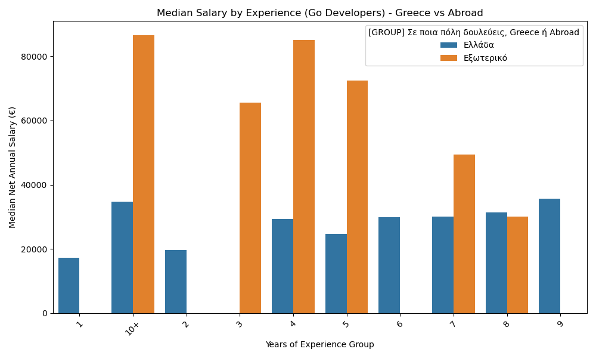
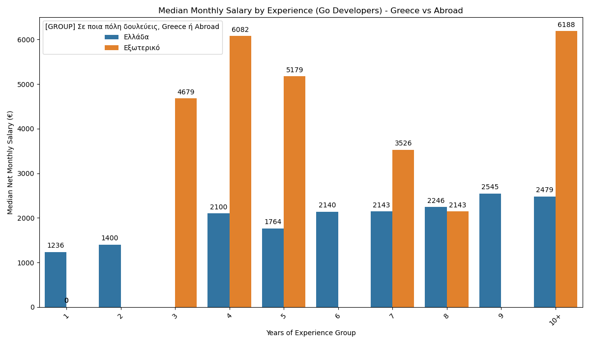
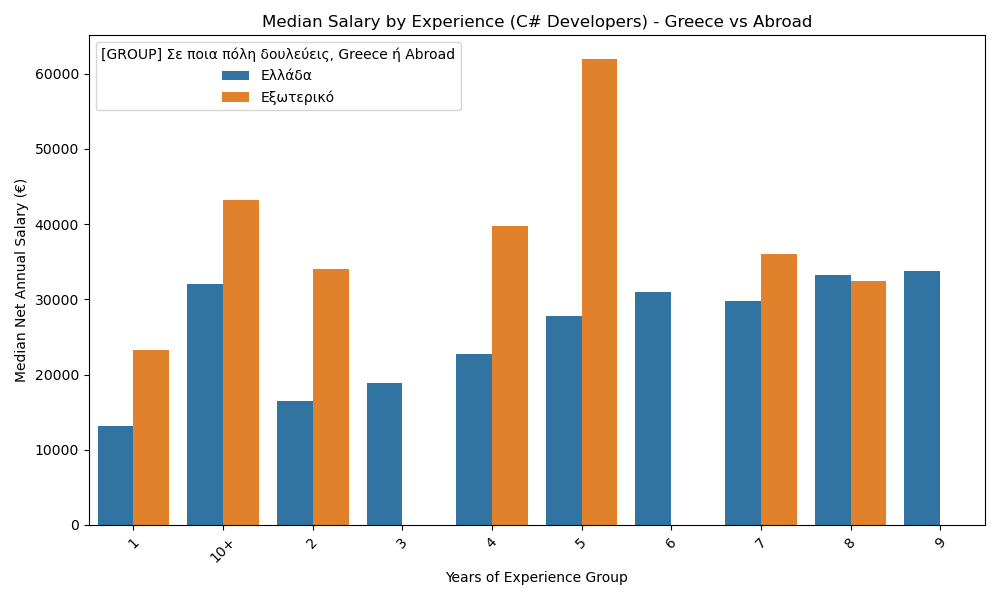
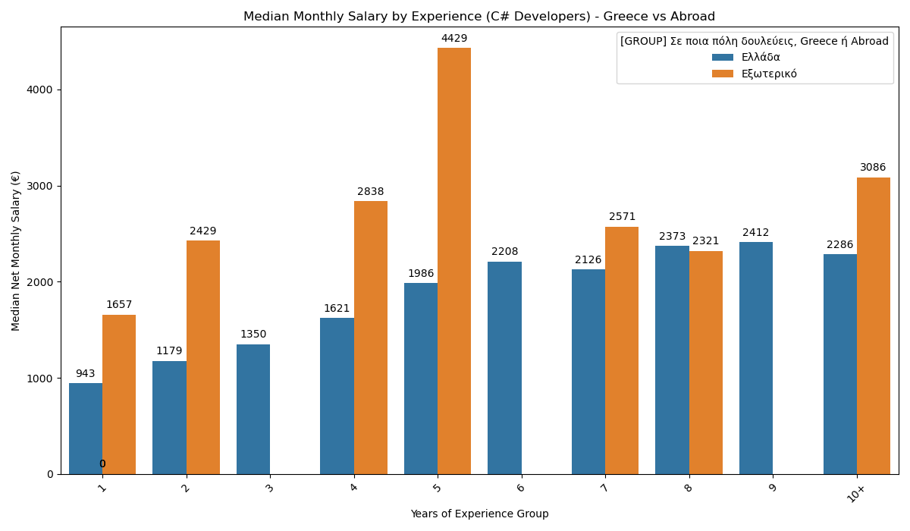
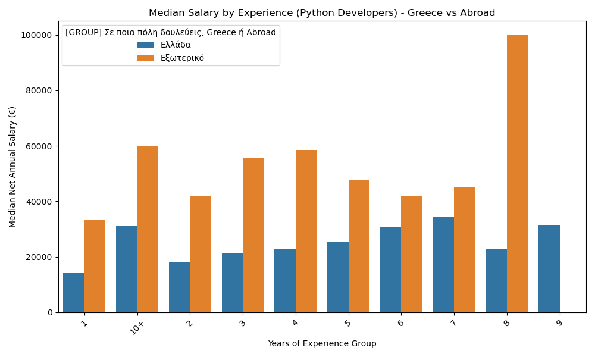
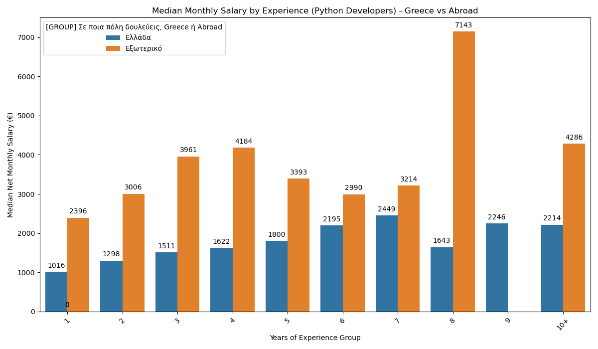
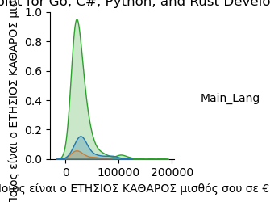

# Salary Analysis of Developers in Greece

This repository contains an analysis of developer salaries in Greece, based on a 2024 survey. The analysis focuses on developers working with Go, C#, and Python.

## Go Developers

### Annual Salary

### Monthly Salary

## C# Developers

### Annual Salary

### Monthly Salary

## Python Developers

### Annual Salary

### Monthly Salary

## Pairplot of All Languages

